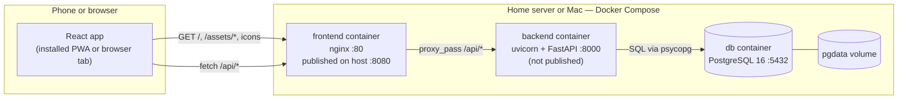
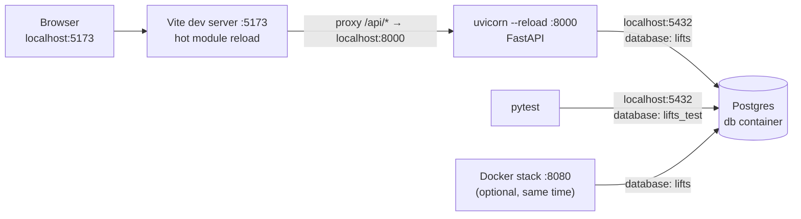
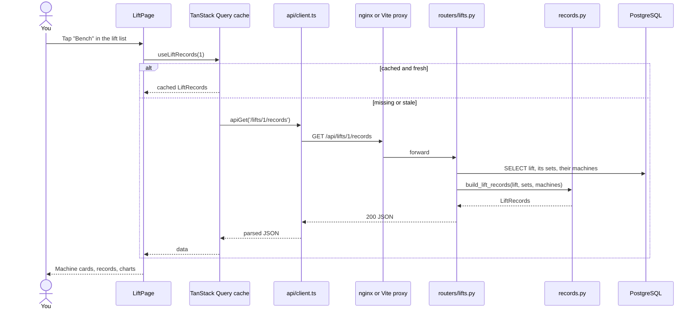
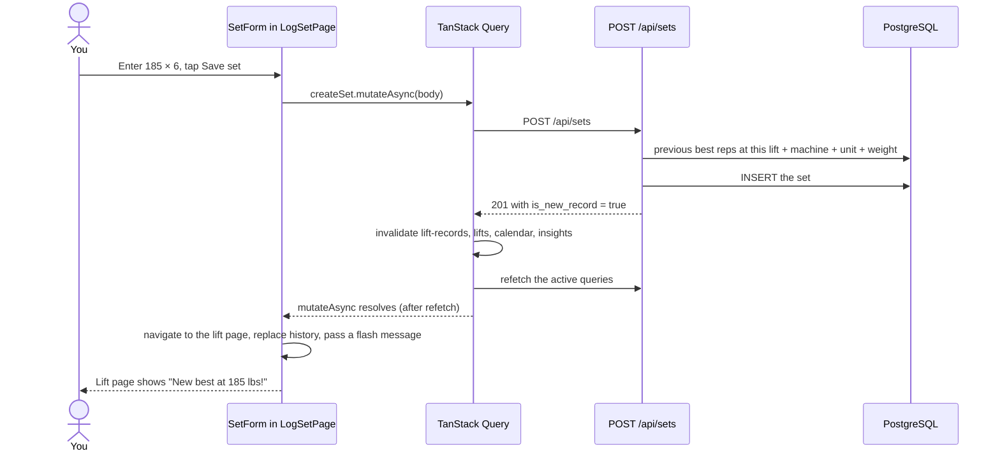

# Architecture

How Lift Tracker is put together: the moving parts, how they talk to each other, how a request travels through the system, and the rules that cut across every layer.

---

## At a glance

Lift Tracker is a **single-user web app** with three parts:

1. **Frontend:** a React single-page app, installable on a phone's home screen (a PWA). It's mobile-first: big tap targets, readable between sets, usable one-handed.
2. **Backend:** a FastAPI REST service under `/api`. It owns all business rules: records, PRs, the weekly split, insights.
3. **Database:** PostgreSQL 16.

Everything runs in Docker Compose. In production (a home server reached over Tailscale) the browser only ever talks to **nginx**, which serves the built frontend and forwards `/api` to the backend. There is **no authentication**: the app is meant to be reachable only on a private network.

### Technology stack

| Layer | Technology | Version (Oct 2026) | Where it's pinned |
| --- | --- | --- | --- |
| Language (backend) | Python | 3.12 | `backend/.python-version` |
| Web framework | FastAPI | 0.142 | `backend/uv.lock` |
| ASGI server | uvicorn | 0.54 | `backend/uv.lock` |
| ORM / models | SQLModel (on SQLAlchemy 2.0, Pydantic 2) | 0.0.47 | `backend/uv.lock` |
| Migrations | Alembic | 1.20 | `backend/uv.lock` |
| Postgres driver | psycopg 3 (binary) | 3.3 | `backend/uv.lock` |
| Tests | pytest + FastAPI `TestClient` (httpx) | 9.1 | `backend/uv.lock` |
| Python packaging | uv | 0.12.21 | `backend/Dockerfile` |
| Database | PostgreSQL | 16 | `docker-compose.yml` |
| UI library | React | 19 | `frontend/package-lock.json` |
| Routing | React Router (declarative mode) | 8.4 | `frontend/package-lock.json` |
| Server state | TanStack Query | 5.104 | `frontend/package-lock.json` |
| Language (frontend) | TypeScript | 6.0 | `frontend/package-lock.json` |
| Build / dev server | Vite | 8.3 | `frontend/package-lock.json` |
| Lint | oxlint | 1.x | `frontend/package-lock.json` |
| Web server (prod) | nginx | 1.29 | `frontend/Dockerfile` |
| Containers | Docker Compose | — | `docker-compose.yml` |

There is deliberately **no CSS framework, UI kit, chart library or icon library**. Styling is plain CSS modules, and charts, icons and the body figure are hand-drawn SVG.

---

## System diagram (production / Docker)



- The browser sees **one origin** (`http://host:8080`), so there's no CORS configuration anywhere.
- The backend container runs `alembic upgrade head` every time it starts, so the database schema is always current.
- Data lives in the named Docker volume `pgdata` and survives container rebuilds and `docker compose down` (but not `docker compose down -v`).

See [Docker and deployment](../07-operations/docker-and-deployment.md) for the full details.

---

## Development topology

During development you run the backend and frontend directly on your Mac for fast reloads. Only Postgres runs in Docker.



- Vite's proxy (`frontend/vite.config.ts`) plays the same role as nginx does in production.
- Tests use a separate database, `lifts_test`, in the same Postgres container, so they never touch your real data.
- The dev servers and the full Docker stack can run side by side. They **share the same `lifts` database**.

---

## Layers and responsibilities

| Layer | Lives in | Responsible for | Not responsible for |
| --- | --- | --- | --- |
| Pages | `frontend/src/pages/` | One screen per route: fetch data with hooks, arrange components, navigate | Talking to `fetch` directly |
| Components | `frontend/src/components/` | Reusable UI with props; local UI state | Knowing which URL they're on (except `TabBar`, `BackLink`) |
| Data layer | `frontend/src/api/` | HTTP calls, TypeScript types, caching and invalidation | Rendering |
| Utilities | `frontend/src/*.ts` | Pure helpers: formatting, dates, calendar maths, swipe detection | React state (except the `useSwipe` hook) |
| Routers | `backend/app/routers/` | HTTP: parse input, call helpers, choose status codes | Business rules |
| Domain logic | `backend/app/{records,calendar,insights,metadata,names}.py` | Business rules as plain functions | HTTP details (except `HTTPException` in `metadata.py`) |
| Schemas | `backend/app/schemas.py` | API request/response shapes and validation | Storage |
| Models | `backend/app/models.py` | Table definitions | API shape |
| Migrations | `backend/migrations/` | Evolving the schema safely | — |
| Database | PostgreSQL | Durable storage; integrity constraints (unique names, reps > 0, …) | Business logic |

---

## Request lifecycle: reading (opening a lift page)



## Request lifecycle: writing (logging a set)



The refetch happens **before** navigating back, so the lift page is already up to date when it appears. See [Data layer](../06-frontend/data-layer.md#invalidation-matrix) for which queries every mutation refreshes.

---

## Repository layout

```
fitness-tracker/
├── README.md                  Project readme: features, run, backups, deploy
├── docker-compose.yml         db + backend + frontend services
├── seed_data.json             Starter data (the original notes-app history)
├── scripts/
│   ├── backup.sh              pg_dump → backups/*.sql.gz
│   └── restore.sh             Restore a backup (asks first)
├── docs/                      This wiki
├── backend/
│   ├── pyproject.toml         Dependencies and pytest config
│   ├── uv.lock                Exact dependency versions
│   ├── alembic.ini            Alembic config (URL comes from app.db)
│   ├── Dockerfile             Backend image
│   ├── app/
│   │   ├── main.py            FastAPI app; mounts routers under /api
│   │   ├── db.py              Engine, sessions, DATABASE_URL
│   │   ├── models.py          Tables (SQLModel)
│   │   ├── schemas.py         API bodies (Pydantic)
│   │   ├── names.py           Name normalisation and lookup
│   │   ├── metadata.py        Shared create/update/list for metadata
│   │   ├── records.py         Records, Epley, progress points
│   │   ├── calendar.py        Per-day activity and PR detection
│   │   ├── insights.py        Plateau and overdue flags
│   │   └── routers/           One file per resource
│   ├── migrations/            Alembic environment and versions
│   ├── scripts/seed.py        Idempotent import of seed_data.json
│   └── tests/                 pytest suite (61 tests)
└── frontend/
    ├── package.json           npm scripts and dependencies
    ├── vite.config.ts         Dev server + /api proxy
    ├── index.html             HTML shell, PWA meta tags
    ├── nginx.conf             Production web server config
    ├── Dockerfile             Two-stage build → nginx image
    ├── public/                Manifest and icons (served as-is)
    └── src/
        ├── main.tsx           Entry: providers
        ├── App.tsx            Routes, swipe handling, tab bar
        ├── api/               client.ts, types.ts, queries.ts
        ├── pages/             One component per route
        ├── components/        Shared UI
        └── *.ts               Utilities (format, dates, calendar, …)
```

Every file is listed with a description in the [file index](../09-reference/file-index.md).

---

## Cross-cutting concerns

These rules show up in every layer. Breaking one usually means a subtle bug.

### Units are never converted
The app records exactly what the machine or bar shows: the stack number, or **plates per side**. Comparisons (records, PRs, charts) only happen within the same **lift + machine + unit**. `185 lbs` and `185 kg` are unrelated numbers to the app. See [Domain glossary → Weight](domain-glossary.md#weight-value-and-unit).

### Dates are local, timestamps are UTC
- `performed_on` is a plain calendar date (`YYYY-MM-DD`), with no time and no timezone. It can be **null** for imported sets whose date is unknown.
- `created_at` / `updated_at` are UTC timestamps (`timestamptz`).
- The frontend never parses `"2026-09-25"` with `new Date(string)`, because that's treated as UTC midnight and shows the previous day in US timezones. It builds dates from their parts (`frontend/src/dates.ts`, `format.ts`).
- Anything that depends on **today** (the insights endpoint) takes the date **from the client**, because the server runs on UTC.

### Archive, don't delete
Gyms, muscle groups, lifts and machines are never deleted. Archiving hides them from lists and pickers but keeps their history visible. Sets *can* be deleted. See [Design decisions](design-decisions.md#6-archive-metadata-never-delete-it).

### Names are unique ignoring case and surrounding spaces
`" chest "` and `"Chest"` are the same muscle group. This is enforced by the database (`lower(trim(name))` unique indexes) and mirrored in code (`app/names.py`). Creating an existing name returns the existing item instead of an error. See [API overview → Idempotent create](../05-api/README.md#idempotent-create).

### Caching
The frontend caches all server data in TanStack Query. Rarely changing data (muscle groups, lifts, machines, gyms, settings, split) is cached **forever** and only refetched when the app itself changes it. Frequently changing data (records, calendar, insights) refetches when you revisit a page. There's no server-side cache.

### Errors
- The backend returns FastAPI's standard `{"detail": ...}` bodies with conventional status codes (404, 409, 422).
- The frontend turns non-2xx responses into an `ApiError` carrying the status and message. Pages show a "Couldn't load" line; forms show the message inline.
- Queries retry network and 5xx errors 3 times, but never retry 4xx.

### Security model
Single user, no login, no CORS, development-grade database credentials (`lifts`/`lifts`). This is acceptable only because the app is reachable solely on your own machine or private Tailscale network. **Don't expose it to the public internet as-is.** See [Docker and deployment → Security](../07-operations/docker-and-deployment.md#security-notes).
