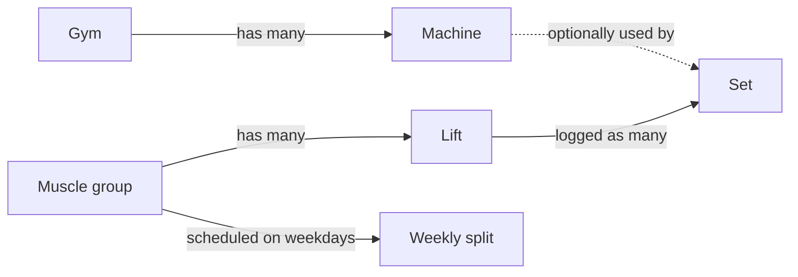

# Domain glossary

Every term the app uses, what it means precisely, and the business rules attached to it. Other pages link here rather than redefining things.

---

## The core objects



### Gym
A place you train. The seed creates one ("Main gym"). The data model supports several gyms, but the UI assumes one: new machines are always created in the **first** gym, and there is no gym picker. Machine names are unique per gym.

### Muscle group
A top-level category on the Home screen, e.g. *Chest*, *Back*, *Legs*. Names are unique across the whole app. Each muscle group has a [body figure](../06-frontend/components.md#bodyfigure) whose highlighted part is chosen from keywords in its name.

### Lift
An exercise, e.g. *Bench*, *Lat pulldown*, *Hammer curl*. Every lift belongs to **exactly one** muscle group. Variations are part of the name (*Overhead extensions*), not a separate field. Lift names are unique **within** a muscle group, so *Curl* can exist under both Biceps and Forearms.

### Machine
A piece of **equipment**, in the broad sense: *Barbell*, *Dumbbell*, *Pec dec* and *Dual cable* are all machines.

- **Machines are independent of lifts.** One machine (e.g. *Dual cable*) is used by many lifts, and one lift can be done on several machines. Machines are never nested under lifts.
- A set's machine is **optional**. Sets without one are grouped as **"No machine"** (bodyweight, or simply unrecorded).
- Machines belong to a gym, and their names are unique per gym.

### Set
One logged set: a lift, optionally a machine, a weight and unit, a rep count, whether the reps were approximate, the date it was performed (optional), and free-text notes. This is the main table. In Python it's called `WorkoutSet` to avoid clashing with Python's built-in `set`.

---

## Weights, reps and dates

### Weight value and unit
- **Value:** a non-negative decimal with up to 2 decimal places (`72.5`, `155.5`). Stored exactly (`NUMERIC(7,2)`), never as a float.
- **Unit:** one of `lbs`, `kg`, `plates`.
  - `plates` means **plates per side**, used on plate-loaded machines.
- **The app never converts between units.** It records exactly what the machine shows. Every comparison (records, PRs, charts) happens only within the same **lift + machine + unit**.

### Comparison scope
The tuple **(lift, machine, unit, weight)** is the unit of comparison for records and PRs. "No machine" counts as its own machine. The same number in different units, or on different machines, is never compared.

### Reps and approximate reps
`reps` is a whole number greater than 0 (enforced by the API **and** a database check constraint). `approximate` marks reps you weren't sure of ("7-ish"). It's displayed as `7~` and otherwise treated as a normal number.

### Performed on (and undated sets)
The calendar date of the set, or **null** when unknown. Some imported sets have no date. Undated sets:
- **appear** in records and history (always last in "newest first" lists),
- **don't appear** in the calendar or progress charts (they can't be placed on a timeline),
- **do count** as the earliest history when deciding PRs.

### Default unit
A setting (`lbs` by default). It's used for the unit picker only when you log a lift on a machine **for the first time**. After that, the form remembers the unit you last used on that lift + machine.

---

## Records and personal bests

### Recency order
"Most recent" is decided the same way everywhere (`recency_key` in `backend/app/records.py`):
1. Dated sets are newer than undated sets.
2. Among dated sets, the later date is newer.
3. Ties (same date, or both undated) go to the higher id, i.e. the one **entered later**.

### Record
For a given **lift + machine + unit**, the record **at a weight** is the set with the **most reps** at that weight. If two sets tie on reps, the more recent one wins. A lift page shows one record row per distinct weight, heaviest first, e.g. `185 lbs × 5 · Sep 25`.

### Estimated one-rep max (est. 1RM)
An estimate of the heaviest single rep you could do, using the **Epley formula**:

```
est. 1RM = weight × (1 + reps / 30), rounded half-up to the nearest 0.5
```

| Set | Calculation | est. 1RM |
| --- | --- | --- |
| 185 × 5 | 185 × 1.1667 = 215.83 | **216** |
| 175 × 6 | 175 × 1.2 = 210 | **210** |
| 72.5 × 9 | 72.5 × 1.3 = 94.25 | **94.5** |
| 100 × 1 | 100 × 1.0333 = 103.33 | **103.5** |

- It's **null for plates**, because a plate count isn't a weight.
- For a 1-rep set the estimate is slightly *above* the weight lifted. That's how the formula behaves, and it's kept as specified.

### New best (at save time)
When you log a set, the API answers `is_new_record`. It's **true** if no earlier set at the same lift + machine + unit + weight had **at least as many reps**:
- the **first** set at a weight → new best,
- **more reps** than ever at that weight → new best,
- a **tie** → not a new best.

The lift page then shows the green **"New best at 185 lbs!"** banner. Here "earlier" means *any set already in the database*, whatever its date.

### PR (personal record) in the calendar and insights
The same rule as "new best", but worked out from history by **replaying every set in recency order**. A set is a PR if it was the first at its weight, or beat the most reps there **at the time it was done**. Because it uses dates rather than entry order, a backdated set can be a PR in the calendar even if it wasn't a "new best" when you entered it, and the reverse.

> With imported history almost every set is the first at its weight, so almost every set counts as a PR. The count settles down as you repeat weights. (This rule was a deliberate choice; see [Design decisions](design-decisions.md#12-pr-rule-the-first-set-at-a-weight-counts).)

### Session / progress point
For charts, a **session** is one date's sets for a lift + machine + unit. Its **progress point** is the day's best set by:
- **est. 1RM**, for lbs and kg,
- **heaviest weight**, for plates.

A chart needs at least two dated sessions.

---

## Weekly split and insights

### Weekly split
Which muscle groups you plan to train on each weekday. Each weekday can have any number of muscle groups. A weekday with none is a **rest day**. Weekdays are numbered **Monday = 0 … Sunday = 6** (Python's `date.weekday()`). The split is edited in Settings and saved as a whole week at once.

### Today
"Today" always means **the phone's local date**, not the server's. The frontend sends it to the insights endpoint (`?today=YYYY-MM-DD`). Home uses it to put today's split muscle groups first, with a **TODAY** label.

### Overdue
A muscle group is **overdue** when it has fallen behind this week's split. Count, for the current week (Monday to today):

- **scheduled days passed** = how many of its split weekdays fall **before** today,
- **days trained** = how many **distinct dates** this week have at least one set for a lift in that group.

It's overdue if `days trained < scheduled days passed`.

- Training on a different day than scheduled still counts.
- Today's scheduled groups are never overdue yet.
- Last week's training doesn't count.

Overdue groups get an amber **OVERDUE** label on Home.

### Plateau
A lift is **plateaued** if it has at least one set dated in the **last 28 days** (today included) and **none** of those sets is a PR (calendar rule above). Plateaued lifts get an amber **Plateau** pill in the muscle group's lift list. Lifts you haven't trained in the last 28 days are never plateaued.

### Heat level
How bright a calendar square is. It's based on **sets logged that day** relative to your busiest day:

| Sets that day | Level |
| --- | --- |
| 0 | 0 |
| up to 25% of your busiest day | 1 |
| up to 50% | 2 |
| up to 75% | 3 |
| more than 75% | 4 |

It's calculated as `ceil(sets / max × 4)`. Because the scale is relative, older squares get dimmer when you have a bigger day.

---

## Metadata lifecycle

### Metadata
The umbrella term for **gyms, muscle groups, lifts and machines**: the things you name and organise, as opposed to the sets you log. All metadata tables share `id`, `name`, `archived` and `created_at`.

### Normalised name
The form used for uniqueness: `lower(trim(name))`. The **stored** name keeps your casing but has surrounding whitespace stripped.

### Idempotent create
Creating metadata with a name that already exists **in the same scope** returns the existing item (HTTP 200) instead of an error or a duplicate. If that existing item was archived, it's **unarchived**. That's what makes "type a new value and tap Add" safe. The scopes are:
- the whole app, for gyms and muscle groups,
- the muscle group, for lifts,
- the gym, for machines.

### Archive / unarchive
Archiving hides an item from lists, pickers and Home, but its sets still show in history, records and the calendar. To bring an item back:
- use **Unarchive** in its Edit panel, if you can still reach its page,
- or create it again with the same name.

Metadata is never deleted. **Sets** are deleted for real, after a confirmation.

### Rename
Changing an item's display name. Renaming onto a name another item already uses (even an archived one) is refused (HTTP 409). Merging two items isn't supported. Case-only renames of the same item (`chest` → `Chest`) are allowed.

---

## UI terms

| Term | Meaning |
| --- | --- |
| **Tab** | One of the bottom-bar destinations: Home, Calendar, Settings. Two slots left of Home are blank placeholders for future tabs. |
| **Tab page** | `/`, `/calendar`, `/settings`. Only these respond to left/right swipes. |
| **Machine card** | One card per machine on a lift page: records per unit, a progress chart, and an expandable history. |
| **Flash message** | A one-off banner on the lift page after saving ("New best at 185 lbs!", "Logged 185 lbs × 4", "Set updated", "Set deleted"), passed via router state. |
| **Body figure** | The small SVG person on each Home tile, with the muscle group's body part highlighted. Back, triceps and glutes show the figure from behind. |
| **Combobox** | The machine picker in the set form: type to filter, tap to pick, or "Add “name”" to create. |
