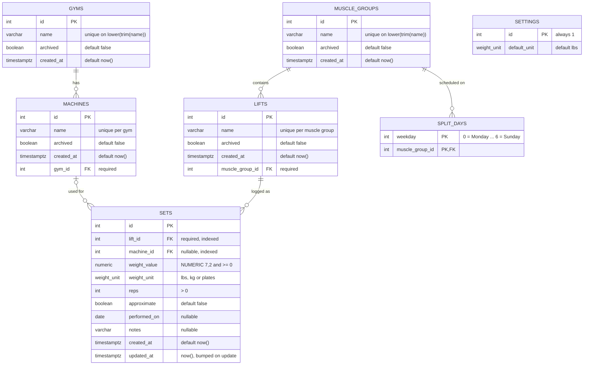

# Database overview

Lift Tracker stores everything in **PostgreSQL 16**: seven application tables plus Alembic's bookkeeping table. This page shows how they relate and the conventions they share. Column-by-column detail is in [Tables](tables.md).

---

## Entity-relationship diagram



- `GYMS` → `MACHINES`: every machine belongs to exactly one gym.
- `MUSCLE_GROUPS` → `LIFTS`: every lift belongs to exactly one muscle group.
- `LIFTS` → `SETS`: every set is for exactly one lift.
- `MACHINES` → `SETS`: a set has **zero or one** machine (`machine_id` is nullable).
- `MUSCLE_GROUPS` → `SPLIT_DAYS`: a muscle group can be scheduled on any number of weekdays.
- `SETTINGS` stands alone: exactly one row.
- Not shown: `alembic_version` (Alembic's record of which migration the database is at).

---

## Tables at a glance

| Table | Rows represent | Model class | Created in migration |
| --- | --- | --- | --- |
| [`gyms`](tables.md#gyms) | A place you train | `Gym` | `0001_initial_schema` |
| [`muscle_groups`](tables.md#muscle_groups) | A Home-screen category | `MuscleGroup` | `0001_initial_schema` |
| [`lifts`](tables.md#lifts) | An exercise | `Lift` | `0001_initial_schema` |
| [`machines`](tables.md#machines) | A piece of equipment | `Machine` | `0001_initial_schema` |
| [`sets`](tables.md#sets) | One logged set | `WorkoutSet` | `0001_initial_schema` |
| [`settings`](tables.md#settings) | App settings (single row) | `Settings` | `0001_initial_schema` |
| [`split_days`](tables.md#split_days) | One muscle group on one weekday | `SplitDay` | `0002_split_days` |
| [`alembic_version`](tables.md#alembic_version) | Current migration revision | — | Alembic itself |

Model classes are defined in [`backend/app/models.py`](../../backend/app/models.py) (see [Core modules → models.py](../04-backend/core-modules.md#modelspy)).

---

## Conventions

### Metadata columns
`gyms`, `muscle_groups`, `lifts` and `machines` all share four columns from the `MetadataBase` class:

| Column | Type | Rule |
| --- | --- | --- |
| `id` | `integer` (serial) | Primary key |
| `name` | `varchar(100)` | Stored **trimmed** but with original casing. Unique on `lower(trim(name))` within scope. |
| `archived` | `boolean` | Default `false`. Archived rows are hidden from lists but never deleted. |
| `created_at` | `timestamptz` | Set by the database (`now()`) |

### Naming
| Prefix | Kind | Example |
| --- | --- | --- |
| `uq_` | Unique (expression) index | `uq_lifts_muscle_group_name` |
| `ck_` | Check constraint | `ck_sets_reps_positive` |
| `ix_` | Plain index (generated by SQLAlchemy for `index=True`) | `ix_sets_lift_id` |
| `*_pkey`, `*_fkey` | Postgres default names for primary/foreign keys | `sets_lift_id_fkey` |

### Enum type
`weight_unit` is a Postgres `ENUM ('lbs', 'kg', 'plates')`, shared by `sets.weight_unit` and `settings.default_unit`. Adding a unit means an `ALTER TYPE weight_unit ADD VALUE …` migration.

### Time
- `date` columns (`performed_on`) hold plain calendar dates with no timezone.
- `timestamptz` columns are stored in UTC. Postgres's `now()` fills them in.
- `sets.updated_at` is refreshed by SQLAlchemy's `onupdate=func.now()` whenever the ORM updates a set. Raw SQL updates don't touch it.

### Deletion semantics
- Foreign keys have **no `ON DELETE` action** (the default, `NO ACTION`). Trying to delete a lift that has sets fails. That's intentional, since metadata is archived, never deleted.
- Only `sets` rows are deleted in normal use (`DELETE /api/sets/{id}`).
- `split_days` rows are deleted and re-inserted whenever the split is saved.

### What the database enforces (vs the app)
| Rule | Database | API | Frontend |
| --- | --- | --- | --- |
| Unique names per scope (case/space-insensitive) | ✅ unique index | ✅ returns existing / 409 | — |
| `reps > 0` | ✅ check | ✅ `gt=0` | ✅ form validation |
| `weight_value >= 0`, max 2 decimals | ✅ check + `NUMERIC(7,2)` | ✅ `ge=0`, `decimal_places=2` | ✅ regex |
| Unit is lbs/kg/plates | ✅ enum | ✅ enum | ✅ segmented control |
| One settings row | ✅ `id = 1` check | — | — |
| Weekday 0–6 | ✅ check | ✅ `ge=0, le=6` | ✅ fixed list |
| Ids exist | ✅ foreign keys | ✅ `get_or_404` → 404 | — |

---

## Connecting with psql

```bash
docker compose exec db psql -U lifts -d lifts
```

| Command | Does |
| --- | --- |
| `\dt` | List tables |
| `\d sets` | Describe a table (columns, indexes, constraints) |
| `\dT+ weight_unit` | Show the enum's values |
| `\q` | Quit |

End every SQL statement with `;`. If the prompt changes from `lifts=#` to `lifts-#`, psql is waiting for the rest of a statement.

### Useful queries

```sql
-- Row counts
SELECT (SELECT count(*) FROM muscle_groups) AS groups,
       (SELECT count(*) FROM lifts)         AS lifts,
       (SELECT count(*) FROM machines)      AS machines,
       (SELECT count(*) FROM sets)          AS sets;

-- One lift's sets, with machine names, newest first
SELECT s.id, m.name AS machine, s.weight_value, s.weight_unit, s.reps, s.approximate, s.performed_on
FROM sets s
JOIN lifts l ON l.id = s.lift_id
LEFT JOIN machines m ON m.id = s.machine_id
WHERE l.name = 'Bench'
ORDER BY s.performed_on DESC NULLS LAST, s.id DESC;

-- The weekly split, readable
SELECT sd.weekday, mg.name
FROM split_days sd JOIN muscle_groups mg ON mg.id = sd.muscle_group_id
ORDER BY sd.weekday, mg.name;

-- Archived items
SELECT 'lift' AS kind, name FROM lifts WHERE archived
UNION ALL SELECT 'machine', name FROM machines WHERE archived
UNION ALL SELECT 'muscle group', name FROM muscle_groups WHERE archived;

-- Which migration is applied
SELECT * FROM alembic_version;
```

### Databases in the container
| Database | Used by |
| --- | --- |
| `lifts` | The app (dev servers and the Docker stack) |
| `lifts_test` | pytest (created automatically, rebuilt on every test run) |
| `postgres` | Postgres's default maintenance database. The test suite connects to it to create `lifts_test`. |
