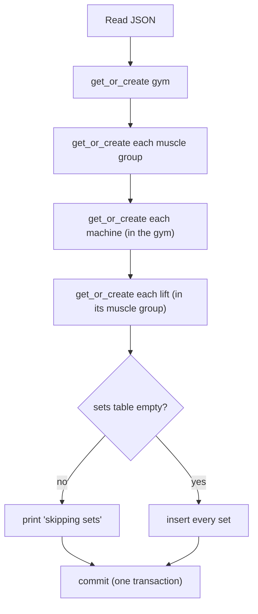

# Seed data

`seed_data.json` holds the training history that existed before the app (cleaned up from a notes app). `backend/scripts/seed.py` loads it into the database. The seed is **idempotent**: you can run it any number of times without creating duplicates.

---

## Running the seed

| Where | Command |
| --- | --- |
| Local development (from `backend/`) | `uv run python -m scripts.seed` |
| A different file | `uv run python -m scripts.seed path/to/other.json` |
| Inside the Docker stack | `docker compose exec backend uv run --no-sync python -m scripts.seed` |

The script prints what it created:

```text
Seeding from /Users/you/fitness-tracker/seed_data.json
  created gyms: Main gym
  created muscle_groups: Chest
  …
  created 40 sets
Done.
```

On a second run:

```text
Seeding from …/seed_data.json
  sets table already has 40 rows; skipping sets
Done.
```

> Run it with `-m scripts.seed` from `backend/` (not `python scripts/seed.py`). The `-m` form puts `backend/` on Python's import path so `import app` works.

**Default file location:** `DEFAULT_SEED_PATH = Path(__file__).resolve().parents[2] / "seed_data.json"`. That resolves to the repo root locally, and to `/seed_data.json` inside the backend container, where `docker-compose.yml` mounts the file read-only.

---

## File format: `seed_data.json`

Everything references other things **by name**, not id. The seed resolves names to ids using the same case-insensitive rules as the database.

```jsonc
{
  "_conventions": { ... },          // documentation only; ignored by the script
  "gym": { "name": "Main gym" },
  "muscle_groups": ["Chest", "Back", ...],
  "machines": ["Barbell", "Pec dec", ...],
  "lifts": [
    { "name": "Bench", "muscle_group": "Chest" },
    ...
  ],
  "sets": [
    {
      "lift": "Bench",
      "machine": "Barbell",          // or null for "No machine"
      "weight_value": 185,
      "weight_unit": "lbs",          // lbs | kg | plates
      "reps": 5,
      "approximate": false,
      "performed_on": "2026-09-25",  // or null when unknown
      "notes": null
    },
    ...
  ]
}
```

| Key | Type | Meaning |
| --- | --- | --- |
| `_conventions` | object | Human-readable notes on the format (weight rule, units, date format, what a null machine means). Not read by the script. |
| `gym.name` | string | The single gym. All `machines` are created in it. |
| `muscle_groups` | string[] | Muscle group names, created in this order, which is also their Home-screen order. |
| `machines` | string[] | Machine names. |
| `lifts[].name` | string | Lift name. |
| `lifts[].muscle_group` | string | Must match an entry in `muscle_groups` (exact string; it's used as a dictionary key). |
| `sets[].lift` | string | Must match a `lifts[].name` exactly. |
| `sets[].machine` | string \| null | Must match a `machines` entry exactly, or be `null`. |
| `sets[].weight_value` | number | Converted with `Decimal(str(value))`, so `72.5` stays exact. |
| `sets[].weight_unit` | `"lbs"` \| `"kg"` \| `"plates"` | Converted with `WeightUnit(value)`; anything else raises an error. |
| `sets[].reps` | int > 0 | The database rejects 0 or negatives. |
| `sets[].approximate` | boolean | Reps were approximate ("7~"). |
| `sets[].performed_on` | `"YYYY-MM-DD"` \| null | Parsed with `date.fromisoformat`. |
| `sets[].notes` | string \| null | |

### Current contents

| Item | Count |
| --- | --- |
| Gyms | 1 (Main gym) |
| Muscle groups | 8: Chest, Back, Legs, Biceps, Triceps, Forearms, Abs, Shoulders |
| Machines | 12: Barbell, Pec dec, Individual cable, Power tower - single pulley, Power tower - dual pulley, Dual cable, Both-legs machine, Individual leg machine, Lying machine, Hip thrust machine, Dumbbell, Incline bench |
| Lifts | 18 |
| Sets | 40 (dated 2026-08-21 to 2026-09-29, plus 7 undated; 1 approximate; plates on Hip thrust and Leg press; one set with no machine) |

---

## How the script works

Source: [`backend/scripts/seed.py`](../../backend/scripts/seed.py)



### Functions

**`get_or_create(session, model, name, **scope)`**
- Looks the name up with `app.names.find_by_name` (case- and space-insensitive, archived or not, within `scope`).
- If found, returns it **unchanged**: the seed never unarchives anything you've archived.
- Otherwise it creates the item with the trimmed name, calls `session.flush()` to get its id without committing, and prints `created <table>: <name>`.

**`seed(session, data)`**
- Resolves the gym, muscle groups, machines and lifts in that order, building name → object dictionaries.
- Counts rows in `sets`. If any exist, it prints a message and returns **without importing sets**.
- Otherwise it adds a `WorkoutSet` for each entry, converting types as described above.

**`main()`**
- Picks the path (first CLI argument, or the default), opens one `Session`, runs `seed`, and commits **once** at the end. Any error (a bad unit, a missing name, a database constraint) rolls the whole thing back, so nothing is written.

### Why sets are all-or-nothing
Sets have no natural key: two sets of 185 × 5 on the same day are both real. Matching sets by their contents would either drop legitimate duplicates or still insert duplicates. So the rule is simple: **import sets only into an empty table**.

The catch: if you log a set in the app before seeding, the seed skips all imported sets. To import anyway, you'd have to delete your sets first. Take a backup before doing that.

---

## Changing the seed data

- Fix typos or add history directly in `seed_data.json`, keeping names consistent between sections (`sets[].lift` must exactly match a `lifts[].name`).
- To re-import into an **existing** database you'd need to empty the `sets` table first. For a fresh start it's easier to use a new database (e.g. `docker compose down -v`, **which deletes all data**, then migrate and seed again).
- `seed_data.json` is committed to the repo and mounted into the backend container, so treat it as public.
