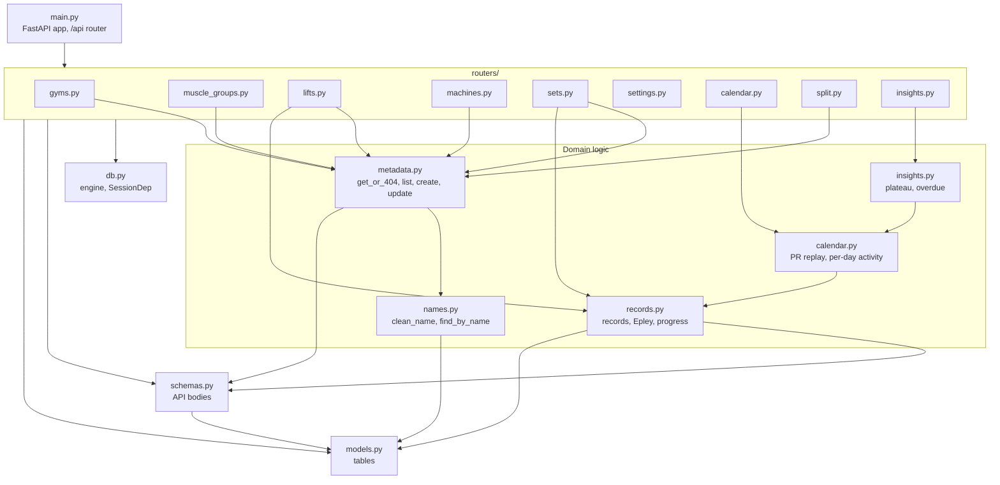
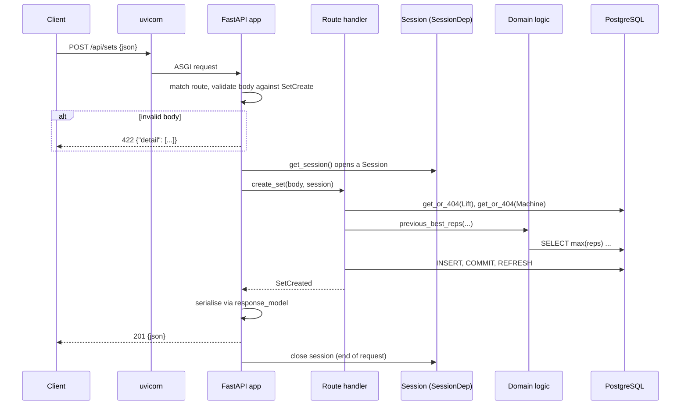

# Backend overview

The backend is a **FastAPI** application in `backend/app/`. It exposes a JSON REST API under `/api`, owns every business rule, and talks to Postgres through **SQLModel** (SQLAlchemy + Pydantic). This page maps the modules and explains how a request flows through them. Each file is documented in detail on the pages linked below.

| Page | Covers |
| --- | --- |
| [Core modules](core-modules.md) | `main.py`, `db.py`, `models.py`, `schemas.py`, package `__init__.py` files |
| [Domain logic](domain-logic.md) | `names.py`, `metadata.py`, `records.py`, `calendar.py`, `insights.py` |
| [Routers](routers.md) | Every file in `app/routers/` |
| [Configuration](configuration.md) | `pyproject.toml`, `uv.lock`, `.python-version`, `alembic.ini`, ignore files, environment |
| [Migrations](../03-database/migrations.md) | `migrations/` |
| [Seed data](../03-database/seed-data.md) | `scripts/seed.py` |
| [Testing](../08-testing/testing.md) | `tests/` |
| [Docker and deployment](../07-operations/docker-and-deployment.md#backend-image) | `Dockerfile`, `.dockerignore` |

---

## Module map

Arrows mean "imports from".

### Layering rules
1. **Routers** only translate HTTP ↔ Python: read path/query/body, load rows, call domain functions, pick status codes.
2. **Domain modules** hold the rules. `records.py`, `calendar.py` and `insights.py` are almost entirely **pure functions** over lists of model objects. The only exception is `previous_best_reps`, which runs one query.
3. **`schemas.py`** depends only on `models.py` (for the `WeightUnit` enum).
4. **`models.py`** depends on nothing in the app.
5. Nothing imports from `routers/` except `main.py`.

Keeping logic out of routers means it can be unit-tested without HTTP, and reused, as when `insights.py` reuses `calendar.find_pr_set_ids`.

---

## Anatomy of a request

1. **Routing:** `main.py` builds an `APIRouter(prefix="/api")` and includes each resource router (each with its own prefix such as `/lifts`).
2. **Validation:** FastAPI validates path/query parameters and the request body against Pydantic models from `schemas.py`. Failures return **422** automatically.
3. **Dependencies:** route functions declare `session: SessionDep`. FastAPI calls `get_session()`, which yields a `Session` for the request and closes it afterwards.
4. **Handler:** loads rows, calls domain functions, commits if it changed anything.
5. **Errors:** helpers raise `fastapi.HTTPException` (404 from `get_or_404`, 409 from `update_item`, 422 for a duplicate weekday in `PUT /split`). FastAPI turns these into `{"detail": "..."}` responses.
6. **Serialisation:** the handler's return value is converted through `response_model`. Schemas built from ORM objects use `from_attributes=True` (`ReadModel`).

---

## Transactions

There's no implicit transaction-per-request. Each handler that writes calls `session.commit()` itself:

| Handler(s) | Commit pattern |
| --- | --- |
| `create_or_restore`, `update_item` (metadata) | One commit per call |
| `create_set`, `update_set`, `delete_set` | One commit |
| `update_settings` | One commit |
| `replace_split` | Delete all rows + insert the new ones, then **one commit**, so the change is atomic |
| Read-only handlers | No commit |

The seed script commits once at the very end, so a failure leaves nothing behind.

---

## Interactive API docs

FastAPI generates OpenAPI docs from the code:

| URL | What |
| --- | --- |
| `http://localhost:8000/docs` | Swagger UI. Try every endpoint in the browser. |
| `http://localhost:8000/redoc` | ReDoc. A read-only reference view. |
| `http://localhost:8000/openapi.json` | The raw OpenAPI schema |

In the Docker stack the backend isn't published. Use the dev server (port 8000) for these, or temporarily add a `ports` entry to the `backend` service.

Docstrings on route functions appear as endpoint descriptions there, and `Field(description=…)` on schema fields appears in the schema view.
