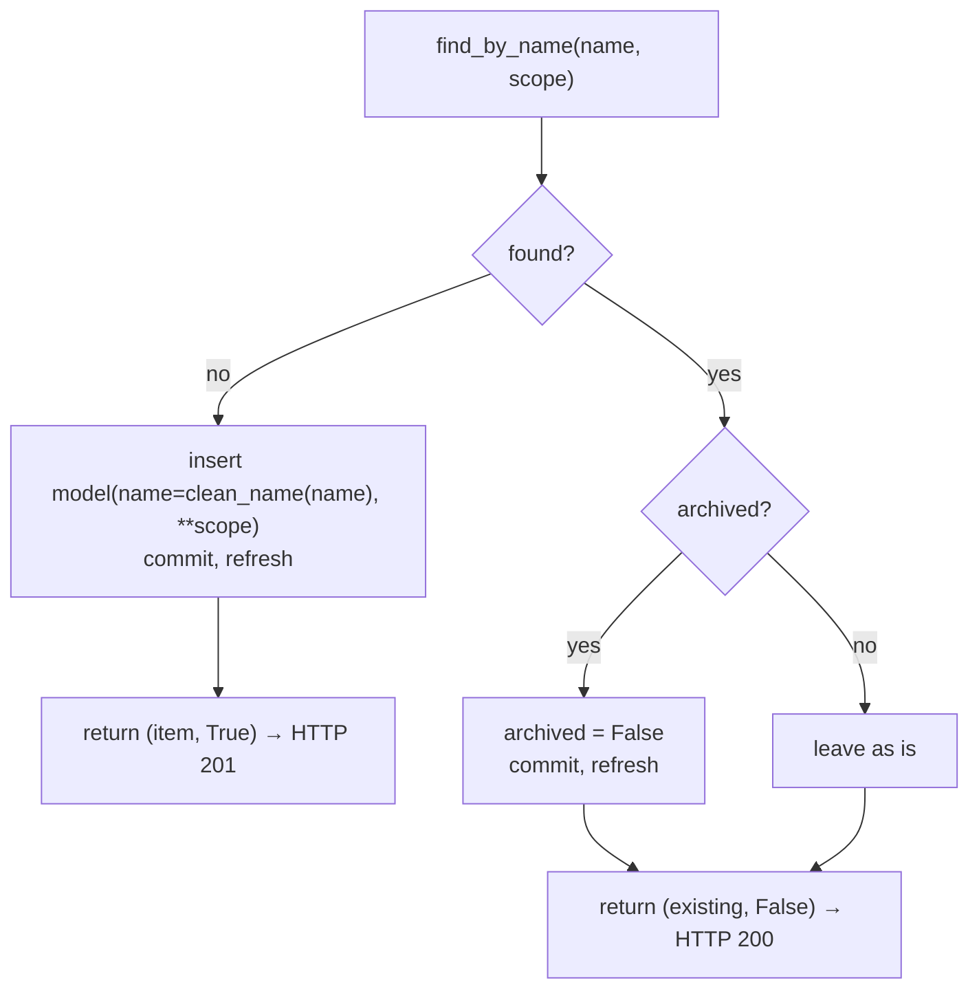
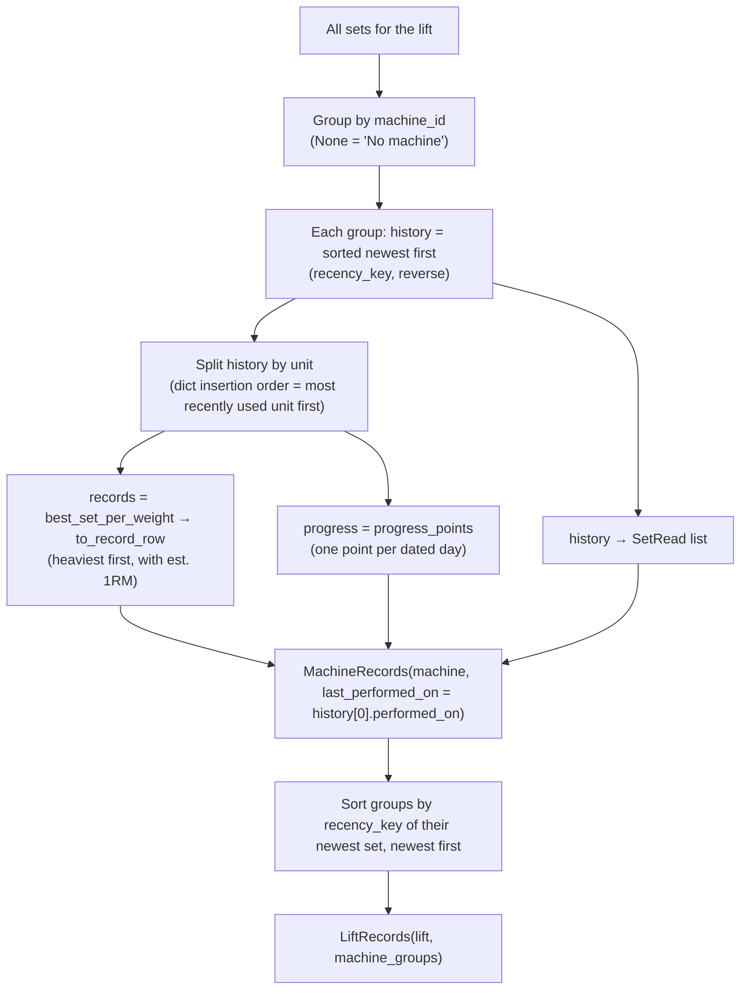
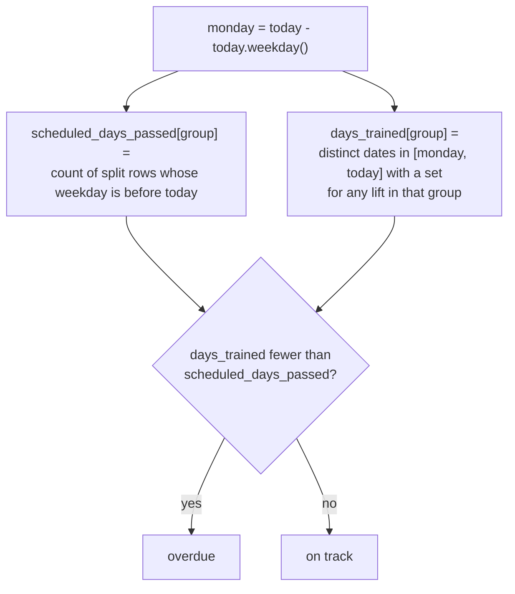

# Domain logic

The business rules of Lift Tracker live in five modules. Apart from two small exceptions (noted below), they're **plain functions**: they take lists of model objects, return schema objects, and know nothing about HTTP. That makes them easy to read, test and reuse.

| Module | Rules it owns |
| --- | --- |
| [`names.py`](#namespy) | How names are cleaned and matched case-insensitively |
| [`metadata.py`](#metadatapy) | Shared list / create / rename / archive behaviour for gyms, muscle groups, lifts, machines |
| [`records.py`](#recordspy) | Records per weight, recency order, Epley est. 1RM, progress points, "new best" check |
| [`calendar.py`](#calendarpy) | Which sets were PRs (history replay), per-day activity |
| [`insights.py`](#insightspy) | Plateaued lifts and overdue muscle groups |

The vocabulary used here (record, PR, session, overdue…) is defined in the [Domain glossary](../01-overview/domain-glossary.md).

---

## names.py

**File:** [`backend/app/names.py`](../../backend/app/names.py)

### `clean_name(name: str) -> str`
Returns `name.strip()`. This is the display name that gets stored: your casing is kept, surrounding whitespace is removed. (The API's `Name` type already strips input; this is used again by the seed and by `metadata.py` for safety.)

### `find_by_name(session, model, name, **scope) -> model | None`
Finds a row whose name matches **case-insensitively**, whether archived or not.

```python
select(model).where(func.lower(func.trim(model.name)) == func.lower(clean_name(name)))
# plus, for each scope keyword: .where(model.<column> == value)
```

- The SQL expression mirrors the unique indexes (`lower(trim(name))`) exactly. Keep them in sync.
- `scope` narrows the search the same way the index does:
  - `find_by_name(session, Lift, "Curl", muscle_group_id=4)`
  - `find_by_name(session, Machine, "Barbell", gym_id=1)`
  - no scope for gyms and muscle groups.
- Used by `metadata.create_or_restore`, `metadata.update_item` and the seed script.

---

## metadata.py

**File:** [`backend/app/metadata.py`](../../backend/app/metadata.py)
Shared behaviour for the four metadata tables. This module (with `routers/split.py`) is the only place outside routers that raises `HTTPException`.

### `get_or_404(session, model, item_id)`
`session.get(model, item_id)`. If it's missing, raises **404** with `detail = "<ModelName> <id> not found"` (e.g. `"Lift 999 not found"`). Works for any table, and is used for ids from both the URL **and** the request body.

### `list_items(session, model, include_archived, **filters)`
- Orders by `id` (creation order).
- Excludes archived rows unless `include_archived` is true.
- Adds `where column == value` for each filter whose value **isn't None**, so `gym_id=None` means "all gyms".

### `create_or_restore(session, model, name, **scope) -> (item, created)`
The idempotent create:



The existing item's **stored name is kept**: creating `"  cHEST "` when `"Chest"` exists returns `"Chest"`.

### `update_item(session, item, changes: MetadataUpdate, **scope)`
Rename and/or archive:
- **Rename** (`changes.name` not None): looks for a clash with `find_by_name(..., **scope)`. If another item (`clash.id != item.id`) already has that name, it raises **409** with `"'<name>' is already used by another item (id N)"` (or "…by an archived item…"). Otherwise it stores `clean_name(changes.name)`. Renaming an item to a different casing of its own name is allowed.
- **Archive** (`changes.archived` not None): sets the flag.
- Then commits, refreshes and returns the item.

The scope passed by routers: lifts use `muscle_group_id=lift.muscle_group_id`, machines use `gym_id=machine.gym_id`, muscle groups pass no scope.

---

## records.py

**File:** [`backend/app/records.py`](../../backend/app/records.py)
Everything behind the lift page.

### `estimated_one_rep_max(weight, reps, unit) -> float | None`
The Epley formula with exact decimal arithmetic:

```python
raw = Decimal(weight) * (1 + Decimal(reps) / 30)
halves = (raw * 2).quantize(Decimal("1"), rounding=ROUND_HALF_UP)
return float(halves / 2)          # nearest 0.5, ties round up
```

It returns `None` for `plates`. Examples: 185 × 5 → 216.0, 100 × 1 → 103.5, 72.5 × 9 → 94.5 (94.25 rounds **up**).

### `recency_key(set) -> (bool, date, int)`
The **one** definition of "most recent" used across the backend:

```python
(performed_on is not None, performed_on or date.min, id)
```

Sorting ascending goes oldest to newest. Undated sets sort before every dated set, and ties fall back to `id` (entry order). `reverse=True` gives newest first.

### `best_set_per_weight(sets) -> list[set]`
For sets of **one unit**, keeps one set per distinct `weight_value`: the one with the most reps, comparing `(reps, recency_key)` so **ties go to the more recent set**. Returns them sorted heaviest first. `Decimal` keys mean `185` and `185.00` are the same weight.

### `chart_value(set) -> float`
What the progress chart plots: `estimated_one_rep_max(...)`, or for plates the weight itself.

### `progress_points(sets) -> list[ProgressPoint]`
For sets of one unit: groups **dated** sets by `performed_on` and keeps each day's set with the highest `chart_value` (the first one wins a tie). Returns one point per day, oldest first. Undated sets are skipped.

### `to_record_row(set) -> RecordRow`
Converts a set to a `RecordRow`, adding `estimated_1rm`.

### `build_lift_records(lift, sets, machines_by_id) -> LiftRecords`
The heart of `GET /lifts/{id}/records`:



Notes:
- `machines_by_id` must contain every machine referenced by the sets. The router loads them, **including archived ones**, which then appear with `archived: true`.
- `last_performed_on` is the newest set's date, which is `null` if every set in the group is undated.
- A lift with no sets returns `machine_groups: []`.

### `previous_best_reps(session, lift_id, machine_id, unit, weight) -> int | None`
The one function here that queries the database: `SELECT max(reps)` over sets with the same lift, unit and exact weight, and the same machine using `IS NOT DISTINCT FROM`, so `NULL` matches `NULL`. `POST /sets` calls it **before** inserting:

```python
is_new_record = previous_best is None or body.reps > previous_best
```

It considers **every** existing set regardless of date. That's why it can occasionally disagree with the calendar's date-ordered PR replay for backdated entries.

---

## calendar.py

**File:** [`backend/app/calendar.py`](../../backend/app/calendar.py)

### `find_pr_set_ids(sets) -> set[int]`
Replays the whole history in `recency_key` order and records which sets were PRs **when they were done**:

```python
best_reps = {}                                   # (lift, machine, unit, weight) -> reps
for s in sorted(sets, key=recency_key):
    key = (s.lift_id, s.machine_id, s.weight_unit, s.weight_value)
    if key not in best_reps or s.reps > best_reps[key]:
        pr_ids.add(s.id); best_reps[key] = s.reps
```

Worked example (Bench, Barbell, lbs, 185):

| Order | Date | Reps | Best so far | PR? |
| --- | --- | --- | --- | --- |
| 1 | (undated) | 3 | — | ✅ first at weight |
| 2 | Sep 01 | 4 | 3 | ✅ beat 3 |
| 3 | Sep 08 | 4 | 4 | ❌ tie |
| 4 | Sep 15 | 6 | 4 | ✅ beat 4 |
| 5 | Sep 15 (entered later) | 5 | 6 | ❌ |

Used by `build_calendar` and by `insights.plateaued_lift_ids`.

### `build_calendar(sets, lifts_by_id, machines_by_id) -> list[CalendarDay]`
1. Computes `pr_ids` over **all** sets (undated ones included, as earliest history).
2. Groups **dated** sets by date. Undated sets are left out of the output.
3. For each date, **newest date first**:
   - groups the day's sets by lift, in order of **first set id** (so lifts appear in the order you trained them),
   - keeps each lift's sets in id order,
   - returns `set_count`, `pr_count` and the nested `lifts`.

### `to_calendar_set(set, machines_by_id, pr_ids) -> CalendarSet`
Flattens a set for the calendar: machine **name** (not id; `None` for no machine) and the `is_pr` flag.

---

## insights.py

**File:** [`backend/app/insights.py`](../../backend/app/insights.py)

`PLATEAU_WINDOW_DAYS = 28` means "the last 4 weeks", including today.

### `plateaued_lift_ids(sets, today) -> list[int]`
```text
window = [today - 27 days, today]
trained = lifts with any set dated in the window
had_pr  = lifts with a PR (find_pr_set_ids) dated in the window
return sorted(trained - had_pr)
```

A lift you haven't done in 28 days is never plateaued. Example (today = Oct 1):

| Bench sets | In window? | PR? | Result |
| --- | --- | --- | --- |
| Aug 1: 185 × 5 | no | yes | — |
| Sep 20: 185 × 5 | yes | no (tie) | |
| Sep 27: 185 × 4 | yes | no | **plateaued** |

### `overdue_muscle_group_ids(sets, lifts_by_id, split_days, today) -> list[int]`



Worked example (today = Thursday Oct 1, so `today.weekday() = 3`; the week is Mon Sep 28 – Thu Oct 1):

| Group | Scheduled | Passed (before Thu) | Trained this week (distinct days) | Overdue? |
| --- | --- | --- | --- | --- |
| Chest | Mon | 1 | 1 (Mon) | no |
| Back | Wed | 1 | 0 | **yes** |
| Legs | Thu | 0 (today doesn't count yet) | 0 | no |
| Back (alt) | Wed | 1 | 1 (trained Thu instead) | no: a different day still counts |
| Chest (twice) | Mon, Wed | 2 | 1 (two sets on Mon = one day) | **yes** |

- Training on any day this week counts toward any scheduled day.
- Last week's training doesn't count.
- `lifts_by_id` must contain every lift referenced by the sets; the router loads them all.

---

## Performance notes

`GET /calendar` and `GET /insights` load **every set**, and `GET /lifts/{id}/records` loads every set for one lift, then compute in Python. For one person training for years (tens of thousands of sets) that's still fast. If the app ever served many users or huge histories, the natural next steps would be to:

- filter by date range in SQL (`performed_on >= …`) for insights,
- page the calendar by month,
- or materialise PR flags in a column updated on write.
