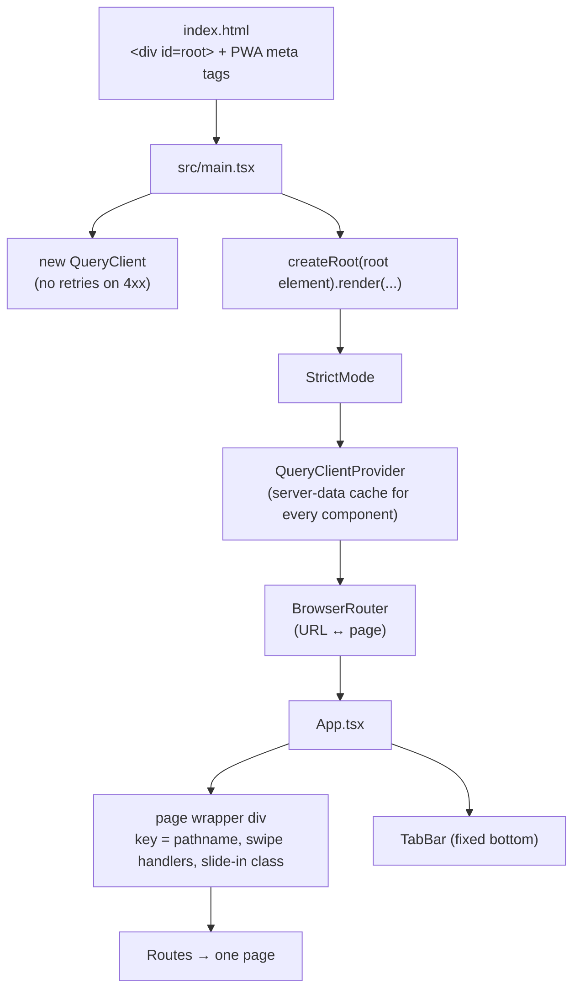
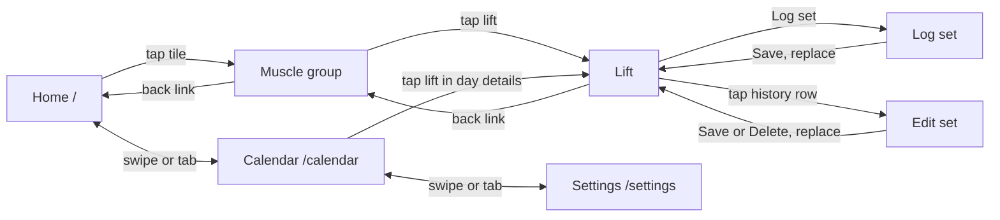
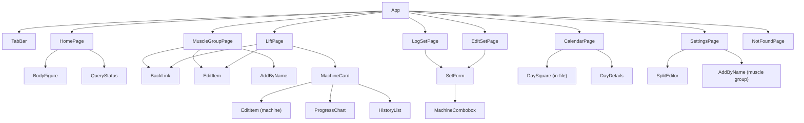

# Frontend overview

The frontend is a **React 19 + TypeScript** single-page app built with **Vite**. It's mobile-first and installable to a phone's home screen. It uses **React Router** for pages and **TanStack Query** for all server data. Styling is plain CSS modules, and there are no UI or chart libraries.

| Page | Covers |
| --- | --- |
| [Routing and pages](routing-and-pages.md) | `App.tsx` and every file in `src/pages/` |
| [Components](components.md) | Every file in `src/components/` |
| [Data layer](data-layer.md) | `src/api/`: HTTP client, types, query hooks, cache invalidation |
| [Utilities](utilities.md) | `format.ts`, `dates.ts`, `calendar.ts`, `records.ts`, `flash.ts`, `tabs.ts`, `useSwipe.ts`, `bodyRegions.ts` |
| [Styling](styling.md) | `index.css`, `App.module.css`, every `*.module.css`, design tokens |
| [PWA and assets](pwa-and-assets.md) | `index.html`, `public/` |
| [Build and tooling](build-and-tooling.md) | `package.json`, `vite.config.ts`, `tsconfig*.json`, `.oxlintrc.json`, ignore files |

---

## How the app starts



1. **`index.html`** loads `/src/main.tsx` and declares the manifest, icons and mobile meta tags.
2. **`main.tsx`** creates the one `QueryClient` and wraps the app in **providers**: `QueryClientProvider` (the cache) and `BrowserRouter` (routing). Every component inside can use their hooks without passing anything down.
3. **`App.tsx`** renders the current route's page inside a wrapper that handles tab swipes and the slide-in animation, and renders the `TabBar` below it.

---

## Route map

| Path | Page | Data hooks | Swipeable tab? | Tab highlighted |
| --- | --- | --- | --- | --- |
| `/` | `HomePage` | `useMuscleGroups`, `useSplit`, `useInsights` | ✅ (index 0) | Home |
| `/muscle-groups/:muscleGroupId` | `MuscleGroupPage` | `useMuscleGroups`, `useLifts`, `useInsights` (+ create lift, update group) | — | Home |
| `/lifts/:liftId` | `LiftPage` | `useLiftRecords`, `useMuscleGroups` (+ update lift) | — | Home |
| `/lifts/:liftId/log` | `LogSetPage` | `useLiftRecords`, `useSettings` (+ create set) | — | Home |
| `/lifts/:liftId/sets/:setId` | `EditSetPage` | `useLiftRecords`, `useSettings` (+ update/delete set) | — | Home |
| `/calendar` | `CalendarPage` | `useCalendar` | ✅ (index 1) | Calendar |
| `/settings` | `SettingsPage` | `useSettings`, `useSplit`, `useMuscleGroups` (+ settings, split, create group) | ✅ (index 2) | Settings |
| `*` | `NotFoundPage` | — | — | Home |

### Navigation flow



- **Tabs** (Home, Calendar, Settings) are reached from the bottom bar or by swiping left/right on a tab page.
- **Drill-down pages** (muscle group → lift → forms) use the **back link** at the top. When installed as an app there's no browser back button, so every non-tab page has one (or a Cancel button).
- **Forms navigate with `replace: true`**, so the phone's back button after saving goes to the muscle group, not back into the form.

---

## Component tree



---

## Folder layout

```
frontend/src/
├── main.tsx              Entry: QueryClient + providers
├── App.tsx               Routes, swipe wrapper, TabBar
├── App.module.css        Page wrapper + slide animations
├── index.css             Design tokens, global rules
├── api/
│   ├── client.ts         fetch wrapper + ApiError
│   ├── types.ts          TypeScript mirrors of backend schemas
│   └── queries.ts        TanStack Query hooks + query keys
├── pages/                One component (+ .module.css) per route
├── components/           Shared UI (+ .module.css each)
└── *.ts                  Pure helpers (format, dates, calendar, records,
                          flash, tabs, bodyRegions) and the useSwipe hook
```

---

## State: where each kind lives

| Kind of state | Where | Example |
| --- | --- | --- |
| **Server data** | TanStack Query cache via hooks in `api/queries.ts` | muscle groups, records, calendar |
| **Local UI state** | `useState` in the owning component | an Edit panel being open, the selected calendar day, the form's values, the split draft |
| **URL state** | The path, read with `useParams` | which lift or set is shown |
| **One-off navigation data** | React Router `location.state` | the "New best!" flash message, the slide direction |
| **Global client state** | *None* | No Redux/Zustand/Context store is needed |

The rule of thumb: if it comes from the server, it's a query. If only one component cares, it's `useState`. If it should survive a reload or be linkable, it's in the URL.

---

## Loading and error pattern

Every page follows the same shape:

```tsx
const records = useLiftRecords(liftId)          // 1. call every hook first
const settings = useSettings()

if (records.isPending || records.isError) {     // 2. then early returns
  return <QueryStatus isError={records.isError} error={records.error} />
}
// 3. here TypeScript knows records.data is defined
```

- Hooks must all run, in the same order, on every render, so they come **before** any `return`.
- `QueryStatus` shows "Loading…" or "Couldn't load: <message>".
- A **404** from the API on a lift renders `NotFoundPage` (`LiftPage` checks `error instanceof ApiError && error.status === 404`). Failed 4xx requests aren't retried, so that happens immediately.
- Optional data (insights badges) doesn't block the page: `insights.data?.…` is simply empty until it loads.

---

## React and TypeScript concepts, and where to see them

This project was also a way to learn React and TypeScript. Each concept below is used, and usually explained in a comment, in the file listed.

| Concept | Where to look |
| --- | --- |
| Components, JSX, `{expressions}` | `pages/HomePage.tsx` |
| Props and `interface` | `components/AddByName.tsx` |
| Optional props (`?`) | `components/SetForm.tsx` (`onDelete?`) |
| `useState`, re-rendering | `components/AddByName.tsx` |
| Controlled inputs | `components/AddByName.tsx`, `SetForm.tsx` |
| Lists and `key` | `pages/HomePage.tsx` |
| Conditional rendering (`&&`, ternary) | `components/MachineCard.tsx`, `HistoryList.tsx` |
| `?.` and `??` | `components/MachineCard.tsx` |
| Rules of hooks (hooks before returns) | `pages/MuscleGroupPage.tsx` |
| Providers | `main.tsx` |
| Routing, `useParams`, `Link` | `App.tsx`, `pages/MuscleGroupPage.tsx` |
| `useNavigate`, router state | `pages/LogSetPage.tsx`, `flash.ts` |
| `useQuery`, `useMutation`, invalidation | `api/queries.ts` |
| `setQueryData`, `mutation.variables` | `api/queries.ts` (`useUpdateSettings`), `pages/SettingsPage.tsx` |
| `useEffect` + cleanup | `components/MachineCombobox.tsx` |
| `useRef` (DOM element) | `components/MachineCombobox.tsx` |
| `useRef` (value that doesn't re-render) | `useSwipe.ts` |
| `useId` | `components/EditItem.tsx` |
| Lazy `useState(() => …)` initialiser | `pages/LiftPage.tsx` |
| Updater form `setState(prev => …)` | `components/SetForm.tsx` |
| Lifting state up / controlled child | `SetForm.tsx` ↔ `MachineCombobox.tsx` |
| Draft vs saved state | `components/SplitEditor.tsx` |
| Custom hooks | `useSwipe.ts` |
| `key` to force a remount | `App.tsx` (page wrapper), `MachineCard.tsx` (chart) |
| `Fragment` with a key | `pages/CalendarPage.tsx` |
| SVG in JSX | `components/BodyFigure.tsx`, `ProgressChart.tsx` |
| Union types, generics, `extends` | `api/types.ts`, `api/client.ts` |
| `Partial<T>` | `components/SetForm.tsx` |
| `instanceof` narrowing | `pages/LiftPage.tsx` |
| `ReactNode` props | `components/TabBar.tsx` |
| `Map`, `Set` | `pages/CalendarPage.tsx`, `pages/HomePage.tsx` |
| Render purity (no clock reads in render) | `dates.ts` (`currentWeekday`) |
