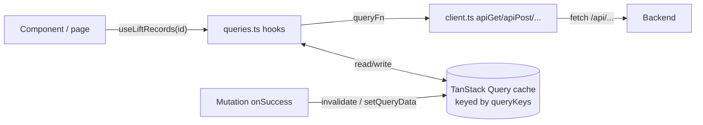

# Data layer

Everything between React components and the API lives in [`frontend/src/api/`](../../frontend/src/api/):

| File | Role |
| --- | --- |
| [`client.ts`](#clientts) | A thin `fetch` wrapper: JSON in and out, errors as `ApiError` |
| [`types.ts`](#typests) | TypeScript interfaces mirroring the backend's response/request schemas |
| [`queries.ts`](#queriests) | TanStack Query hooks: one per piece of server data and per change, plus the query keys |

Components never call `fetch` themselves. They call hooks from `queries.ts`.



---

## client.ts

**File:** [`frontend/src/api/client.ts`](../../frontend/src/api/client.ts)

### `class ApiError extends Error`
Carries the HTTP `status` alongside the `message`. Pages use it to tell "not found" from other failures:
```ts
if (records.error instanceof ApiError && records.error.status === 404) return <NotFoundPage />
```
The global retry rule in `main.tsx` also uses it to skip retries on 4xx.

### `request<T>(method, path, body?)` (internal)
- Calls `fetch('/api' + path, …)`. Paths are relative, so the same code works behind Vite's proxy and nginx.
- Sends `Content-Type: application/json` and `JSON.stringify(body)` only when there is a body.
- A non-2xx response throws `new ApiError(status, await errorMessage(response))`.
- **204** returns `undefined` (DELETE).
- Otherwise returns `await response.json()` cast to `T`. The cast is trust, not validation: TypeScript types aren't checked at runtime.

### `errorMessage(response)` (internal)
Returns the API's `detail` if it's a string (404/409 messages). Otherwise, e.g. for 422 validation lists or non-JSON bodies, it returns `"Request failed (HTTP <status>)"`.

### Exported helpers
| Function | Method | Returns |
| --- | --- | --- |
| `apiGet<T>(path)` | GET | `Promise<T>` |
| `apiPost<T>(path, body)` | POST | `Promise<T>` |
| `apiPatch<T>(path, body)` | PATCH | `Promise<T>` |
| `apiPut<T>(path, body)` | PUT | `Promise<T>` |
| `apiDelete(path)` | DELETE | `Promise<void>` |

`<T>` is a generic type parameter (like Python's `TypeVar`): the caller states the expected response type, e.g. `apiGet<MuscleGroup[]>('/muscle-groups')`.

---

## types.ts

**File:** [`frontend/src/api/types.ts`](../../frontend/src/api/types.ts)

TypeScript descriptions of the JSON the API sends and receives. **They're checked only at compile time.** Nothing verifies responses at runtime, so keep this file in sync with [`backend/app/schemas.py`](../04-backend/core-modules.md#schemaspy) by hand.

| TypeScript type | Mirrors (backend) | Notes |
| --- | --- | --- |
| `WeightUnit` | `WeightUnit` | `'lbs' \| 'kg' \| 'plates'` (a union of string literals) |
| `DateString` | — | Alias for `string`: `"YYYY-MM-DD"` dates and ISO timestamps |
| `MuscleGroup` | `MuscleGroupRead` | |
| `Lift` | `LiftRead` | |
| `LiftListItem extends Lift` | `LiftListItem` | + `last_performed_on` |
| `MetadataUpdate` | `MetadataUpdate` | `name?`, `archived?` |
| `Machine` | `MachineRead` | |
| `WorkoutSet` | `SetRead` | Named like the backend model |
| `SetCreated extends WorkoutSet` | `SetCreated` | + `is_new_record` |
| `SetFields` | `SetUpdate` (the full set) | The edit body; the form always sends all fields |
| `SetCreate extends SetFields` | `SetCreate` | + `lift_id` |
| `Gym` | `GymRead` | |
| `Settings` | `SettingsRead` / `SettingsUpdate` | |
| `RecordRow` | `RecordRow` | |
| `ProgressPoint` | `ProgressPoint` | |
| `UnitRecords` | `UnitRecords` | |
| `MachineRecords` | `MachineRecords` | |
| `LiftRecords` | `LiftRecords` | |
| `CalendarSet`, `CalendarLift`, `CalendarDay` | same names | |
| `SplitDay`, `Split` | `SplitDayBody`, `SplitBody` | |
| `Insights` | `Insights` | |

TypeScript features used here: `interface`, `extends` (like subclassing), union types, `| null`, and optional fields (`?`).

---

## queries.ts

**File:** [`frontend/src/api/queries.ts`](../../frontend/src/api/queries.ts)

### Concepts in brief
- **`useQuery`** fetches and caches data under a **query key**. Every component asking for the same key shares one cached copy and one network request.
- **`staleTime`** says how long cached data counts as fresh. `Infinity` means "never refetch on your own". The default (0) means "refetch when a component using it mounts again or the window regains focus".
- **`useMutation`** performs a change. In `onSuccess` we **invalidate** keys (mark them stale so active queries refetch) or **write** the new value straight into the cache (`setQueryData`).
- Invalidating a key prefix covers every key under it. Invalidating `['lifts']` also refreshes `['lifts', {muscleGroupId: 4}]`.

### Query keys

```ts
export const queryKeys = {
  muscleGroups:        ['muscle-groups'],
  lifts:               ['lifts'],
  liftsForMuscleGroup: (id) => ['lifts', { muscleGroupId: id }],
  allLiftRecords:      ['lift-records'],
  liftRecords:         (id) => ['lift-records', id],
  machines:            ['machines'],
  gyms:                ['gyms'],
  settings:            ['settings'],
  calendar:            ['calendar'],
  split:               ['split'],
  insights:            ['insights'],            // used as ['insights', today]
}
```

Keeping keys in one object avoids typos and makes it obvious what can be invalidated.

### Query hooks

| Hook | Key | Endpoint | `staleTime` | Why |
| --- | --- | --- | --- | --- |
| `useMuscleGroups()` | `['muscle-groups']` | `GET /muscle-groups` | `Infinity` | Metadata; only changes through the app |
| `useLifts(muscleGroupId)` | `['lifts', {muscleGroupId}]` | `GET /lifts?muscle_group_id=` | `Infinity` | Metadata (but `last_performed_on` changes with sets, so set mutations invalidate it) |
| `useLiftRecords(liftId)` | `['lift-records', liftId]` | `GET /lifts/{id}/records` | default | Changes whenever a set changes |
| `useCalendar()` | `['calendar']` | `GET /calendar` | default | Changes with sets |
| `useSplit()` | `['split']` | `GET /split` | `Infinity` | Only changes in Settings |
| `useInsights(today)` | `['insights', today]` | `GET /insights?today=` | default | Depends on sets, the split and the date; the key includes `today` so a new day is a new cache entry |
| `useMachines()` | `['machines']` | `GET /machines` | `Infinity` | Metadata |
| `useGyms()` | `['gyms']` | `GET /gyms` | `Infinity` | Metadata |
| `useSettings()` | `['settings']` | `GET /settings` | `Infinity` | Only changes in Settings |

### Mutation hooks

| Hook | Request | On success |
| --- | --- | --- |
| `useCreateMuscleGroup()` | `POST /muscle-groups {name}` | invalidate `muscle-groups` |
| `useCreateLift(muscleGroupId)` | `POST /lifts {name, muscle_group_id}` | invalidate `lifts` |
| `useCreateMachine()` | `POST /machines {name, gym_id}` | invalidate `machines` |
| `useUpdateMuscleGroup()` | `PATCH /muscle-groups/{id}` | invalidate `muscle-groups` (**not awaited**) |
| `useUpdateLift()` | `PATCH /lifts/{id}` | invalidate `lifts`, `lift-records/{id}`, `calendar` (**not awaited**) |
| `useUpdateMachine()` | `PATCH /machines/{id}` | invalidate `machines`, **all** `lift-records`, `calendar` (**not awaited**) |
| `useUpdateSettings()` | `PATCH /settings` | `setQueryData(settings, response)` (no refetch) |
| `useUpdateSplit()` | `PUT /split` | `setQueryData(split, response)` + invalidate `insights` |
| `useCreateSet(liftId)` | `POST /sets` | `refreshAfterSetChange` (**awaited**) |
| `useUpdateSet(liftId)` | `PATCH /sets/{id}` | `refreshAfterSetChange` (**awaited**) |
| `useDeleteSet(liftId)` | `DELETE /sets/{id}` | `refreshAfterSetChange` (**awaited**) |

`refreshAfterSetChange(queryClient, liftId)` invalidates `lift-records/{liftId}`, `lifts`, `calendar` and `insights` together and returns the combined promise.

### Awaited vs not awaited
- **Set mutations return the promise** from `onSuccess`, so `mutateAsync()` resolves only **after** the refetch. The form then navigates back to an already-updated lift page.
- **Metadata updates don't** (`void queryClient.invalidateQueries(...)`). After archiving a muscle group the page navigates home immediately. If it waited, the refetched list would no longer contain the group and the page would briefly render "Not found".

---

## Invalidation matrix

What each mutation refreshes. ✅ = invalidated (refetched), ✏️ = written directly with `setQueryData`.

| Mutation ↓ / Cache → | muscle-groups | lifts | lift-records | machines | gyms | settings | calendar | split | insights |
| --- | --- | --- | --- | --- | --- | --- | --- | --- | --- |
| Create muscle group | ✅ | | | | | | | | |
| Update muscle group | ✅ | | | | | | | | |
| Create lift | | ✅ | | | | | | | |
| Update lift | | ✅ | ✅ (that lift) | | | | ✅ | | |
| Create machine | | | | ✅ | | | | | |
| Update machine | | | ✅ (all) | ✅ | | | ✅ | | |
| Update settings | | | | | | ✏️ | | | |
| Update split | | | | | | | | ✏️ | ✅ |
| Create / update / delete set | | ✅ | ✅ (that lift) | | | | ✅ | | ✅ |

**When you add a query or mutation, update this table.** Reasoning behind some cells:
- *Set changes → lifts*: the muscle group list shows each lift's `last_performed_on`.
- *Set changes → insights*: plateau and overdue depend on sets.
- *Update machine → all lift-records*: a machine's name appears on every lift that used it.
- *Update lift → calendar*: the calendar shows lift names.
- *Update split → insights*: overdue depends on the split.

### Known gaps (acceptable today)
- Archiving/renaming a **muscle group** doesn't invalidate `insights` or `split`. Badges for archived groups simply aren't shown, and split chips only list visible groups.
- Changes made **outside the app** (curl, `/docs`, another device) to `Infinity` caches don't appear until the page is reloaded.

---

## Global query defaults

Set once in [`main.tsx`](routing-and-pages.md#maintsx):

| Option | Value | Effect |
| --- | --- | --- |
| `retry` | `(count, error) => !(error is ApiError && status < 500) && count < 3` | Retries network and 5xx errors up to 3 times; never retries 4xx |
| everything else | TanStack defaults | e.g. refetch on window focus for stale queries, cached data kept 5 minutes after the last user unmounts |

---

## Adding a new piece of server data

1. Add the interface to `types.ts`.
2. Add a key to `queryKeys`.
3. Add a `useX()` hook with an appropriate `staleTime` (`Infinity` only if *this app* is the only thing that changes it).
4. For each existing mutation that changes this data, add it to `onSuccess`.
5. Update the [invalidation matrix](#invalidation-matrix).
6. Use the hook in a page. Call it before any early return, and handle `isPending` / `isError`.
