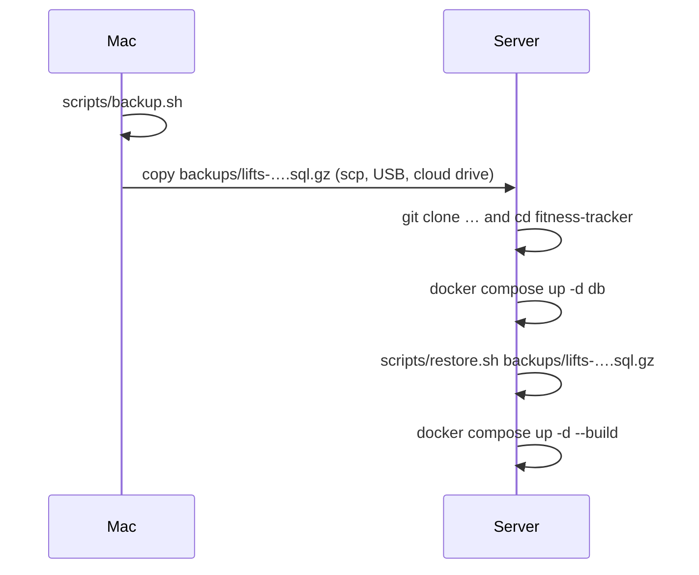

# Backups and restore

Your whole training history lives in one Postgres database inside a Docker volume. Two scripts in [`scripts/`](../../scripts/) back it up to a compressed file and restore it.

> **Backups are git-ignored** (`backups/` is in `.gitignore`), so they never end up on GitHub. That also means they only exist on the machine where you made them. Copy them somewhere safe yourself (cloud drive, another computer).

---

## Taking a backup

```bash
scripts/backup.sh
# Saved backups/lifts-2026-10-02-091530.sql.gz (4.0K)
```

Requirements: run from anywhere inside the repo (the script `cd`s to the repo root), with the `db` container running.

### What `backup.sh` does
**File:** [`scripts/backup.sh`](../../scripts/backup.sh)

1. `set -euo pipefail`: stop on any error, including a failing `pg_dump` in the middle of a pipe.
2. `mkdir -p backups`.
3. Runs `pg_dump` **inside** the db container (no Postgres tools needed on the host):
   ```bash
   docker compose exec -T db pg_dump -U lifts -d lifts --clean --if-exists --no-owner \
     | gzip > "$file.partial"
   ```
   - `--clean --if-exists`: the dump starts by dropping each object if it exists, so **restoring replaces** whatever is in the target database.
   - `--no-owner`: no `ALTER … OWNER` statements, so it restores cleanly under any user.
   - `-T`: no terminal allocation (needed when piping).
4. Writes to `….partial` first, then `mv`s it into place, so a failed dump never leaves a file that looks like a valid backup.
5. Prints the file name and size.

The dump is plain SQL (gzipped). It contains the schema, all data, the `weight_unit` type and `alembic_version`, so a restored database knows which migration it's at.

---

## Restoring a backup

```bash
scripts/restore.sh backups/lifts-2026-10-02-091530.sql.gz
# This replaces ALL data in database 'lifts' with backups/…sql.gz. Continue? [y/N] y
# Restored backups/lifts-2026-10-02-091530.sql.gz into 'lifts'.
```

### What `restore.sh` does
**File:** [`scripts/restore.sh`](../../scripts/restore.sh)

1. Requires the file argument (`${1:?Usage: …}`).
2. Target database: `lifts`, or `$RESTORE_DB` if set.
3. **Asks for confirmation.** Anything other than `y`/`Y` prints "Cancelled." and exits 1.
4. Streams the file into `psql` inside the container:
   ```bash
   gunzip -c "$file" | docker compose exec -T db psql -U lifts -d "$db" \
     --quiet -v ON_ERROR_STOP=1 --single-transaction -o /dev/null
   ```
   - `--single-transaction` + `ON_ERROR_STOP=1`: **all or nothing**. If any statement fails, the database is left exactly as it was.
   - `-o /dev/null --quiet`: hides the noisy query output (`setval` results etc.); errors still show.

After restoring into the app's database, reload the app in your browser. Cached metadata won't know about the change otherwise.

### Testing a backup without touching your data

```bash
docker compose exec -T db psql -U lifts -d lifts -c "CREATE DATABASE lifts_restore_test"
RESTORE_DB=lifts_restore_test scripts/restore.sh backups/lifts-….sql.gz
docker compose exec -T db psql -U lifts -d lifts_restore_test -c "SELECT count(*) FROM sets"
docker compose exec -T db psql -U lifts -d lifts -c "DROP DATABASE lifts_restore_test"
```

---

## Moving to another machine

E.g. from your Mac to a home server:



The restore creates the tables itself (the dump includes the schema), so you don't need to run migrations or the seed first. On startup the backend container runs `alembic upgrade head`, which applies anything newer than the backup.

---

## Suggestions (not set up)

These aren't part of the project yet, but are easy to add:
- **Scheduled backups** on the server, e.g. a nightly cron job:
  ```cron
  0 3 * * * cd /path/to/fitness-tracker && scripts/backup.sh >> backups/backup.log 2>&1
  ```
- **Pruning old backups**, e.g. keeping the last 30: `ls -t backups/*.sql.gz | tail -n +31 | xargs rm -f`
- **Off-machine copies**: sync `backups/` to cloud storage.

Always take a backup before: upgrading the app, running `alembic downgrade`, restoring, or anything involving `docker compose down -v`.
