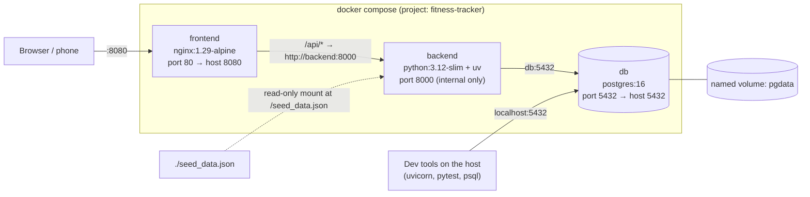

# Docker and deployment

How the app is packaged and run with Docker Compose, both on your Mac and on a home server. It covers every Docker-related file and how to deploy, update and secure the stack.

---

## The stack



Containers reach each other by **service name** on Compose's private network (`backend`, `db`). Only `frontend` (8080) and `db` (5432) are published to the host.

---

## docker-compose.yml

**File:** [`docker-compose.yml`](../../docker-compose.yml)

### `db`
| Setting | Value | Notes |
| --- | --- | --- |
| `image` | `postgres:16` | Official image |
| `environment` | `POSTGRES_USER=lifts`, `POSTGRES_PASSWORD=lifts`, `POSTGRES_DB=lifts` | Development-grade credentials; see [Security](#security-notes) |
| `ports` | `5432:5432` | So tools on the host can connect |
| `volumes` | `pgdata:/var/lib/postgresql/data` | Data survives container rebuilds |
| `healthcheck` | `pg_isready -U lifts -d lifts` every 5s, 3s timeout, 10 retries | The backend waits for "healthy" |
| `restart` | `unless-stopped` | Comes back after a reboot or crash (if Docker starts at boot) |

### `backend`
| Setting | Value | Notes |
| --- | --- | --- |
| `build` | `./backend` | Uses `backend/Dockerfile` |
| `environment` | `DATABASE_URL=postgresql+psycopg://lifts:lifts@db:5432/lifts` | `db` is the service name |
| `volumes` | `./seed_data.json:/seed_data.json:ro` | So the seed script can run inside the container |
| `depends_on` | `db: condition: service_healthy` | Doesn't start until Postgres is ready |
| `restart` | `unless-stopped` | |
| ports | *(none)* | Only reachable through nginx |

### `frontend`
| Setting | Value | Notes |
| --- | --- | --- |
| `build` | `./frontend` | Uses `frontend/Dockerfile` |
| `ports` | `8080:80` | The app's URL is `http://<host>:8080` |
| `depends_on` | `backend` | Start order only (doesn't wait for health) |
| `restart` | `unless-stopped` | |

### `volumes`
`pgdata`, a named volume managed by Docker (full name `fitness-tracker_pgdata`). It persists across `docker compose down`. **`docker compose down -v` deletes it**, and with it all your data.

---

## Backend image

**File:** [`backend/Dockerfile`](../../backend/Dockerfile)

```dockerfile
FROM python:3.12-slim
COPY --from=ghcr.io/astral-sh/uv:0.12.21 /uv /bin/uv
ENV UV_PYTHON_DOWNLOADS=never UV_COMPILE_BYTECODE=1 UV_LINK_MODE=copy
WORKDIR /app
COPY pyproject.toml uv.lock .python-version ./
RUN uv sync --locked --no-dev
COPY . .
EXPOSE 8000
CMD ["sh", "-c", "uv run --no-sync alembic upgrade head && exec uv run --no-sync uvicorn app.main:app --host 0.0.0.0 --port 8000"]
```

| Line | Why |
| --- | --- |
| `python:3.12-slim` | Matches `.python-version`; slim keeps the image small |
| `COPY --from=…uv` | Copies the `uv` binary from its official image, pinned to the version used in development |
| `UV_PYTHON_DOWNLOADS=never` | Use the image's Python; never download another |
| `UV_COMPILE_BYTECODE=1` | Precompile `.pyc` files for faster startup |
| `UV_LINK_MODE=copy` | Copy files into the venv (hard links don't work across Docker layers) |
| Copy the dependency files first, then `uv sync` | **Layer caching**: code changes don't reinstall dependencies |
| `--locked` | Fails if `uv.lock` is out of date with `pyproject.toml` |
| `--no-dev` | No pytest/httpx in production |
| `COPY . .` | The app code (`.dockerignore` excludes `.venv`, caches) |
| `CMD …` | **Runs migrations, then starts uvicorn.** `exec` makes uvicorn the main process so it receives stop signals. `--no-sync` skips re-syncing at runtime. `0.0.0.0` listens on the container network. |

`.dockerignore` excludes `.venv/`, `__pycache__/`, `*.pyc`, `.pytest_cache/`.

---

## Frontend image

**File:** [`frontend/Dockerfile`](../../frontend/Dockerfile). A **two-stage** build:

```dockerfile
FROM node:22-alpine AS build
WORKDIR /app
COPY package.json package-lock.json ./
RUN npm ci
COPY . .
RUN npm run build

FROM nginx:1.29-alpine
COPY nginx.conf /etc/nginx/conf.d/default.conf
COPY --from=build /app/dist /usr/share/nginx/html
```

| Stage | What happens |
| --- | --- |
| `build` (Node 22) | Clean install from the lockfile (`npm ci`), then `npm run build`, which type-checks **and** bundles. A type error fails the image build. |
| final (nginx) | Only the built `dist/` and the nginx config are copied; Node and `node_modules` are left behind. The image is tiny. |

`.dockerignore` excludes `node_modules` and `dist`.

---

## nginx.conf

**File:** [`frontend/nginx.conf`](../../frontend/nginx.conf)

```nginx
server {
    listen 80;
    root /usr/share/nginx/html;

    location /api/ {
        proxy_pass http://backend:8000;
        proxy_set_header Host $host;
        proxy_set_header X-Forwarded-For $proxy_add_x_forwarded_for;
    }

    location = /manifest.webmanifest {
        default_type application/manifest+json;
    }

    location /assets/ {
        add_header Cache-Control "public, max-age=31536000, immutable";
    }

    location / {
        try_files $uri /index.html;
        add_header Cache-Control "no-cache";
    }
}
```

| Block | Purpose |
| --- | --- |
| `location /api/` | Forwards API calls to the backend container. The same job as Vite's dev proxy, which keeps everything same-origin. The path is passed through unchanged (`/api/lifts` → `http://backend:8000/api/lifts`). |
| `location = /manifest.webmanifest` | nginx doesn't know `.webmanifest`; this sets the correct MIME type |
| `location /assets/` | Built JS/CSS have content hashes in their names, so they're cached for a year (`immutable`) |
| `location /` | **SPA fallback**: any path that isn't a real file (e.g. `/lifts/3`) serves `index.html`, and React Router takes over. `no-cache` means the browser revalidates `index.html` every load, so new builds show up immediately. |

---

## Everyday commands

Run from the repo root.

| Task | Command |
| --- | --- |
| Start everything (building if needed) | `docker compose up -d --build` |
| Start just the database (for dev) | `docker compose up -d db` |
| See status | `docker compose ps` |
| Follow backend logs | `docker compose logs -f backend` |
| Rebuild after code changes | `docker compose up -d --build` (or name a service: `… --build frontend`) |
| Seed an empty database | `docker compose exec backend uv run --no-sync python -m scripts.seed` |
| Open psql | `docker compose exec db psql -U lifts -d lifts` |
| Stop the app, keep the DB running | `docker compose stop backend frontend` |
| Stop everything (keeps data) | `docker compose down` |
| **Delete everything including data** | `docker compose down -v` (back up first!) |

After `up`, expect **502 Bad Gateway** from `:8080/api/...` for a few seconds while the backend runs migrations and starts.

---

## Deploying to a home server

The same Compose file runs anywhere Docker runs.

1. **Install Docker** (Docker Engine + the Compose plugin on Linux, or Docker Desktop). Make sure Docker **starts at boot**, so `restart: unless-stopped` brings the app back after a power cut.
2. **Get the code:**
   ```bash
   git clone https://github.com/coopermay/fitness-tracker.git
   cd fitness-tracker
   ```
3. **Move your data** from the Mac. See [Backups → Moving to another machine](backups-and-restore.md#moving-to-another-machine):
   ```bash
   # on the Mac
   scripts/backup.sh
   # copy backups/lifts-<timestamp>.sql.gz to the server's fitness-tracker/backups/
   # on the server
   docker compose up -d db
   scripts/restore.sh backups/lifts-<timestamp>.sql.gz
   ```
4. **Start everything:** `docker compose up -d --build`
5. **Open** `http://<server>:8080`.

### Reaching it away from home with Tailscale
[Tailscale](https://tailscale.com) puts your phone and server on a private network that works from anywhere (the gym, mobile data).
- Install Tailscale on the server and your phone, and sign in to both.
- Open `http://<server's tailscale name>:8080` (e.g. `http://homeserver:8080` with MagicDNS).
- **HTTPS (optional, recommended):** `tailscale serve` can put the app behind an HTTPS address on your tailnet. That's required for Android's full "Install app" prompt. For example, `tailscale serve --bg 8080` (check `tailscale serve --help` for your version's syntax).

### Updating the deployment
```bash
cd fitness-tracker
git pull
scripts/backup.sh               # cheap insurance before migrations
docker compose up -d --build    # rebuilds images; the backend applies new migrations on start
```

---

## Security notes

This app was designed for **one person on a private network**:

| Aspect | Current state | Implication |
| --- | --- | --- |
| Authentication | None | Anyone who can reach port 8080 can read and change everything |
| Database credentials | `lifts` / `lifts` in `docker-compose.yml` | Fine on a private network; not a secret |
| Postgres port | Published on host 5432 | Convenient for dev; on a server you can remove the `ports:` entry from `db` |
| Transport | Plain HTTP on 8080 | Tailscale encrypts traffic between devices; `tailscale serve` adds HTTPS |
| CORS | Not configured | Only same-origin pages can call the API from a browser |

**Do not expose port 8080 (or 5432) to the public internet** with this setup. Keep it on your LAN or Tailscale. If it ever needs to be public, add authentication, real secrets (e.g. an `.env` file, already git-ignored), HTTPS, and close the database port first.
